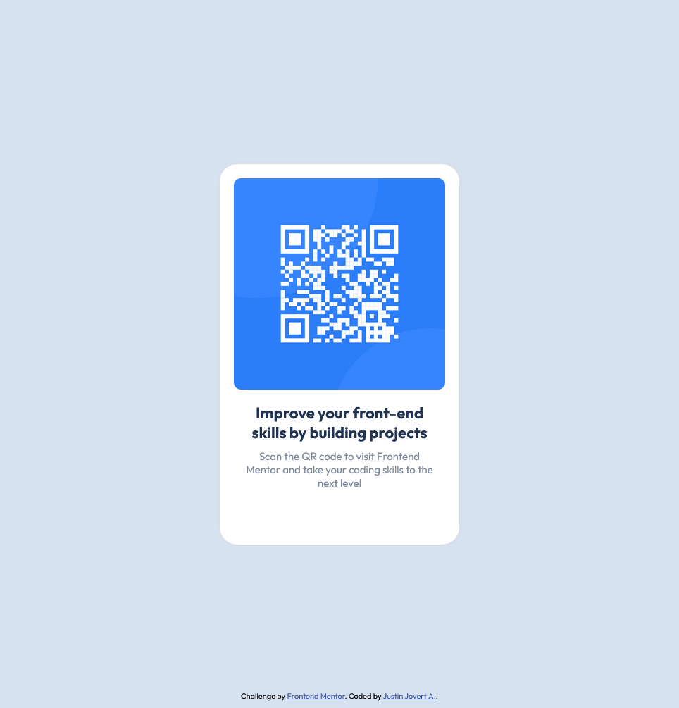

# Frontend Mentor - QR code component solution

This is a solution to the [QR code component challenge on Frontend Mentor](https://www.frontendmentor.io/challenges/qr-code-component-iux_sIO_H). Frontend Mentor challenges help you improve your coding skills by building realistic projects. 

## Table of contents

- [Overview](#overview)
  - [Screenshot](#screenshot)
  - [Links](#links)
- [My process](#my-process)
  - [Built with](#built-with)
  - [What I learned](#what-i-learned)
  - [Continued development](#continued-development)
  - [Useful resources](#useful-resources)
- [Author](#author)
- [Acknowledgments](#acknowledgments)

## Overview
Just a simple QR Code website challenge from Frontend Mentor to solidify my skills. 

### Screenshot

### Links
- Live Site URL: [Live Site](https://justinjovert.github.io/Frontend-Mentor-QR-Code-using-Flexbox/)

## My process

Built a container for a div 'card', that acts as a card for the whole content. Used flexbox to centralize content.

### Built with

- Semantic HTML5 markup
- CSS custom properties
- Flexbox

### What I learned

First repository in Github. Hoping to see more works that I can repo to Github.

### Continued development
- Continue to do challenges to solidify skills.

### Useful resources
- [Asaeneh's 30 Day of JavaScript](https://github.com/Asabeneh/30-Days-Of-JavaScript)

## Author

- [Github](https://github.com/Justinjovert/)
- Frontend Mentor - [Justinjovert](https://www.frontendmentor.io/profile/Justinjovert)

## Acknowledgments

Frontend Mentor and Asabeneh Yetayeh.
